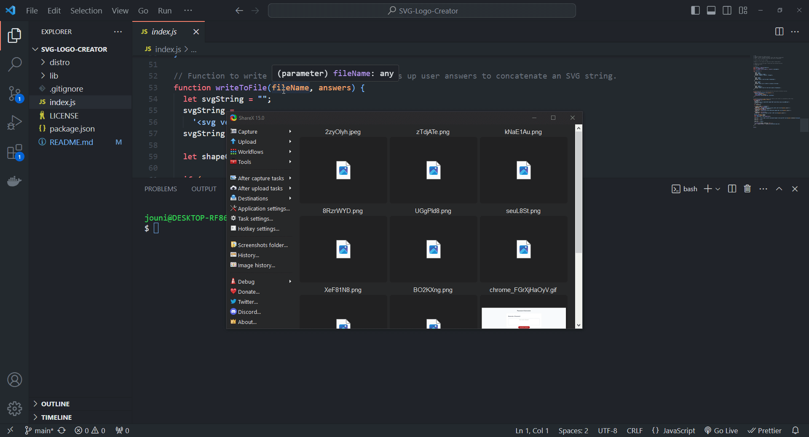

# SVG-Logomaker

## Description

A terminal application to create a logo with basic shapes, colors and text.

## Table of Contents

- [Installation](#installation)
- [Usage](#usage)
- [License](#license)
- [Demo](#Demo)
- [Tests](#tests)
- [Questions](#questions)

## Installation

After pulling down the repo, run npm i in terminal to install dependencies.

## Usage

Run node index in terminal to start application. Answer all questions prompted. Once finised generating an SVG file it will populate in the dist folder of tnis repo.

## License

This project is licensed under the MIT License - see the [LICENSE.md](LICENSE.md) file for details.

## Demo

## Tests

Shapes.test.js was used to ensure the shape render methods returned correctly.

## Questions

If you have any questions, feel free to reach out to me at partidam578@gmail.com. You can also visit [my GitHub profile](https://github.com/mariop578).
